# Save Your Beer

I enjoy trying new beer whenever I can, but remembering which beer I have tried and which I haven't became a major task.  I created this app because I wanted something that could keep track of all the beer I've tried, to alleviate the problem of trying to keep track in my head on the fly.

## Technology

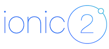

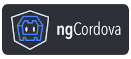

## Screenshots

#### Login/Register View
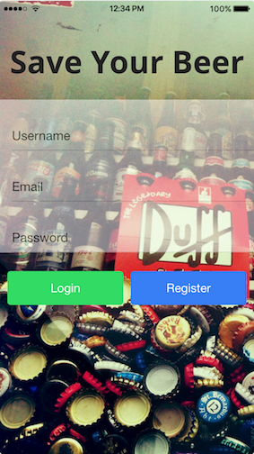

#### Home View
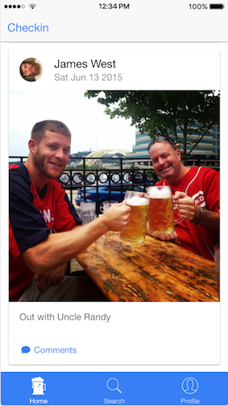

#### Post Comment View
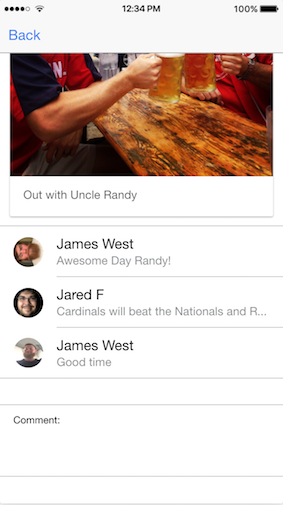

#### Search View
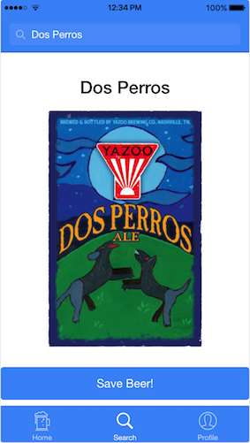

#### Profile View
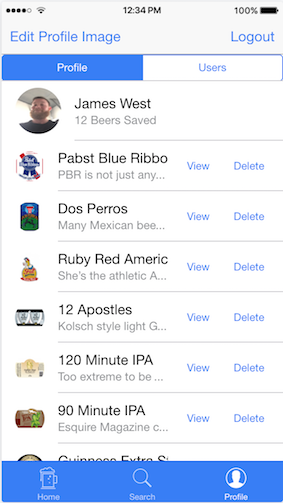

#### View Beer
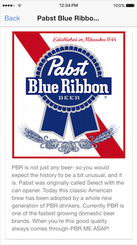

#### See Other Users
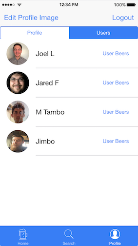

#### View Beer other Users have tried 
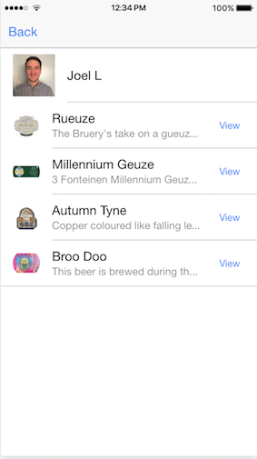

#### Save Beer From Other Users
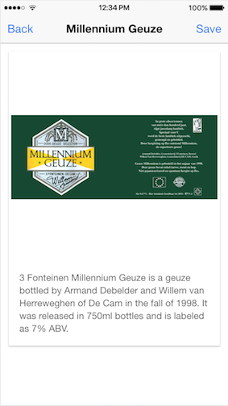

